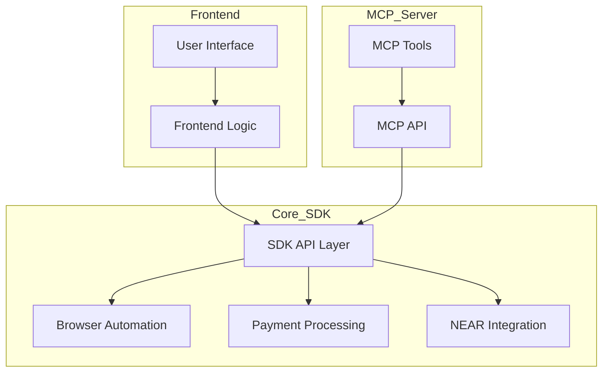
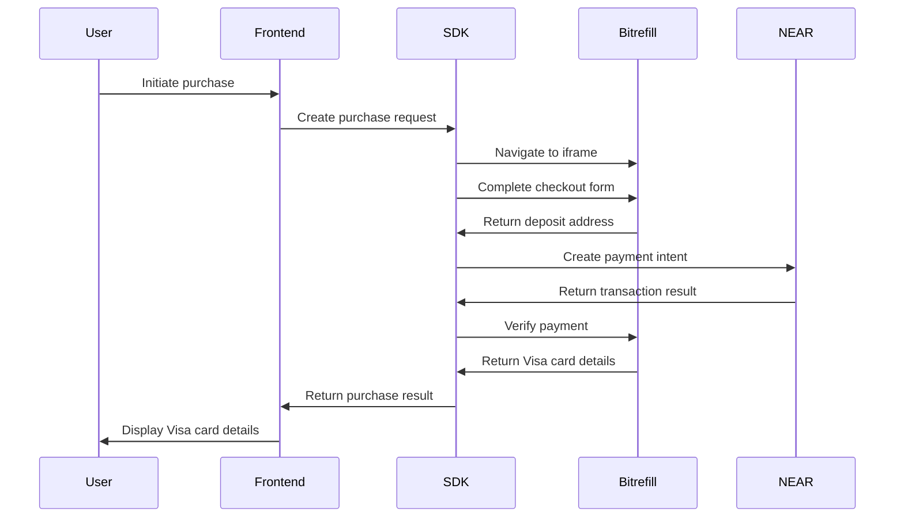
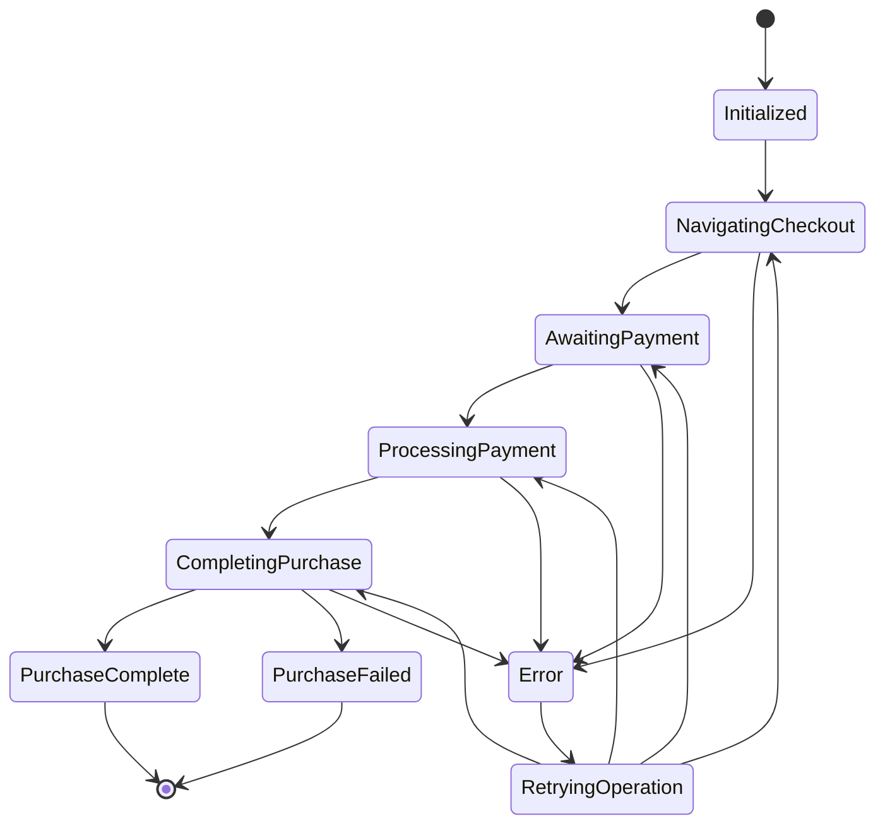

# System Patterns: Sneaky Link

## System Architecture

Sneaky Link follows a modular, layered architecture with clear separation of concerns:

## Key Components

### Core SDK

The foundation of the system, providing the essential functionality:

1. **SDK API Layer**
   - Public interfaces for all SDK functionality
   - Configuration management
   - Session handling

2. **Browser Automation Module**
   - Playwright integration
   - Page navigation logic
   - Element interaction
   - Data extraction

3. **Payment Processing**
   - ZCash transaction handling
   - Payment verification
   - Status tracking

4. **NEAR Integration**
   - Intent creation and management
   - Transaction signing
   - Response handling

### Frontend Application

A user-facing interface built on top of the SDK:

1. **User Interface**
   - Responsive design
   - Step-by-step flow
   - Status visualization

2. **Frontend Logic**
   - SDK integration
   - State management
   - Error handling

### MCP Server

Makes the SDK functionality available to AI agents:

1. **MCP API**
   - SDK wrapper
   - Session management
   - Authentication

2. **MCP Tools**
   - Tool definitions
   - Input validation
   - Response formatting

## Data Flow

The typical data flow through the system:

## Design Patterns

### Core Patterns

1. **Facade Pattern**
   - The SDK API provides a simplified interface to the complex subsystems
   - Hides implementation details from consumers

2. **Strategy Pattern**
   - Pluggable strategies for browser automation steps
   - Allows for adaptation to changes in Bitrefill's UI

3. **Observer Pattern**
   - Event-based system for status updates
   - Enables loose coupling between components

4. **Factory Pattern**
   - Creates appropriate instances of browser, payment, and NEAR handlers
   - Centralizes object creation logic

5. **Command Pattern**
   - Encapsulates browser automation actions as commands
   - Enables retry, undo, and logging capabilities

### Error Handling Patterns

1. **Circuit Breaker**
   - Prevents cascading failures by failing fast
   - Automatically retries after backoff period

2. **Retry with Exponential Backoff**
   - Automatically retries failed operations
   - Increases delay between retries

3. **Fallback Mechanisms**
   - Provides alternative paths when primary path fails
   - Graceful degradation of functionality

## State Management

Purchase flow state machine:

## Technical Decisions

1. **Bun as Runtime**
   - Modern JavaScript/TypeScript capabilities
   - Improved performance over Node.js
   - Built-in TypeScript support

2. **Playwright over Puppeteer**
   - More modern API
   - Better cross-browser support
   - Improved stability and reliability
   - Enhanced debugging capabilities

3. **Modular Architecture**
   - Clear separation of concerns
   - Testable components
   - Maintainable codebase

4. **Event-Driven Communication**
   - Loose coupling between components
   - Scalable architecture
   - Easier to extend and modify

5. **Strong Typing with TypeScript**
   - Improved developer experience
   - Catch errors at compile time
   - Better code documentation

## Integration Points

1. **Bitrefill Integration**
   - Browser automation to navigate checkout flow
   - Form filling and submission
   - Data extraction from pages

2. **ZCash Integration**
   - Deposit address generation
   - Transaction verification
   - Balance checking

3. **NEAR Integration**
   - Intent creation
   - Transaction signing
   - Response handling

4. **MCP Integration**
   - Tool definitions
   - Resource templates
   - Response formatting
